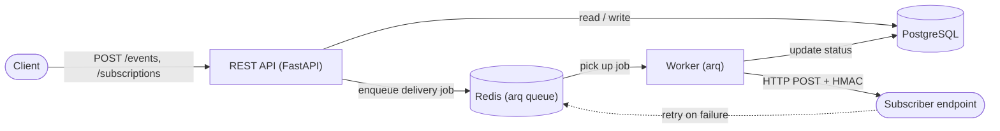

# Webhook Relay

[Русская версия](README.ru.md)

An async webhook delivery service: accepts events over an HTTP API, matches them against subscriptions, and reliably delivers the payload to subscribers — with HMAC signing, exponential-backoff retries, and a dead-letter queue for events that couldn't be delivered.

Modeled on how Stripe Webhooks / Svix work internally — scaled down to a focused portfolio project.

## Demo

Deployed on [cloud.ru](https://cloud.ru) Container Apps:

- **Dashboard** — [webhook-relay.piksi.dev/dashboard/](https://webhook-relay.piksi.dev/dashboard/)
- **API docs (Swagger)** — [webhook-relay.piksi.dev/docs](https://webhook-relay.piksi.dev/docs)

Feel free to create a subscription and send a test event straight from the dashboard.

## Features

- **Event ingestion** via a REST API with idempotency on `idempotency_key` — resending the same event does not create duplicate deliveries.
- **Subscriptions** on event types: an endpoint (`url`) subscribes to a list of `event_types`; when an event is created, the service resolves who should receive it.
- **HMAC request signing** (`X-Signature`, `X-Timestamp`) — the receiver can verify payload authenticity; the subscription secret is stored encrypted at rest (Fernet).
- **Retries with backoff and jitter**: network errors, timeouts, and 5xx/429 responses are retried with exponential backoff; the `Retry-After` header is respected.
- **Dead Letter Queue**: deliveries that exhaust their retry budget or receive a terminal error (4xx) land in the DLQ and can be redriven manually via the API.
- **Full attempt history** — every delivery attempt (HTTP status, duration, error) is recorded separately for traceability.
- **Async processing** — delivery runs on a background worker via a task queue (arq/Redis); the API responds immediately (202 Accepted).
- **Mock receiver** — a separate service for local delivery testing, emulating success/timeout/500/400.
- **Web dashboard** — live view of deliveries, DLQ, and subscriptions, see [Web UI](#web-ui).

## Architecture



Data flow:

1. A client creates a **subscription** (`POST /subscriptions`) with a URL and a list of event types.
2. A client publishes an **event** (`POST /events`). The service finds active subscriptions for that `event_type`, creates one `Delivery` record per subscription, and enqueues a job for each.
3. The background **worker** picks up the job, signs the request body, and POSTs it to the subscriber's URL.
4. Depending on the outcome (success / retryable error / terminal error), the delivery is marked `DELIVERED`, re-queued as `RETRYING` with a delay, or moved to `FAILED` plus a record in **dead_letters**.
5. Failed deliveries can be inspected and manually redriven via `/dead-letters`.

## Stack

- **API** — FastAPI, Pydantic v2
- **Database** — PostgreSQL, SQLAlchemy 2.0 (async), Alembic
- **Task queue** — Redis + arq
- **HTTP client** — httpx (async)
- **Signing/encryption** — HMAC-SHA256, Fernet (cryptography)
- **Tests** — pytest, pytest-asyncio, respx
- **Infrastructure** — Docker, docker-compose
- **Web UI** — Jinja2 + HTMX (server-rendered, no frontend build step)

The project follows a layered architecture: `routes → services → repositories → models`. Business logic (response classification, backoff) is factored into pure, framework-agnostic functions (`core/retry_policy.py`).

## Project layout

```
src/webhook_relay/
├── api/routes/        # HTTP endpoints (events, subscriptions, dead-letters, dashboard)
├── core/              # framework-agnostic business logic (retry policy, etc.)
├── models/            # SQLAlchemy models
├── repositories/       # data access layer
├── schemas/           # Pydantic request/response schemas
├── security/          # HMAC signing, secret encryption
├── services/          # use-case orchestration
├── worker/            # arq worker entrypoint + delivery task
├── templates/         # Jinja2 templates for the dashboard
└── static/            # dashboard CSS
mock_receiver/         # standalone FastAPI app for local delivery testing
tests/
├── unit/              # business logic with mocked dependencies
└── integration/       # full flow against real Postgres/Redis + HTTP API
```

## Running it

### With Docker Compose (recommended)

`docker-compose.yml` does not run Postgres/Redis for development (only for tests, see below) — bring your own Postgres and Redis (local or managed).

```bash
cp .env.example .env
# fill in DATABASE_URL, REDIS_URL, SECRET_ENCRYPTION_KEY
uv run alembic upgrade head
docker compose up --build
```

This starts three services:

- `api` — FastAPI on `localhost:8000` (Swagger: `/docs`)
- `worker` — the arq worker delivering webhooks
- `mock-receiver` — a test webhook receiver on `localhost:9000`

### Locally (uv)

```bash
uv sync
uv run alembic upgrade head
uv run uvicorn webhook_relay.main:app --reload            # API
uv run arq webhook_relay.worker.settings.WorkerSettings    # Worker (separate terminal)
```

## Usage example

```bash
# 1. Create a subscription
curl -X POST localhost:8000/subscriptions/ \
  -H "Content-Type: application/json" \
  -d '{"url": "http://localhost:9000/webhook", "event_types": ["order.created"]}'

# 2. Publish an event
curl -X POST localhost:8000/events/ \
  -H "Content-Type: application/json" \
  -d '{"event_type": "order.created", "payload": {"order_id": 42}, "idempotency_key": "order-42"}'

# 3. Check what the mock receiver got
curl localhost:9000/_control/received

# 4. List delivery attempts for a subscription
curl "localhost:8000/subscriptions/{id}/deliveries"

# 5. Redrive a failed delivery from the DLQ
curl -X POST "localhost:8000/dead-letters/{id}/retry"
```

You can simulate receiver failures by switching the mock receiver's mode:

```bash
curl -X POST localhost:9000/_control/mode/fail     # 500 on every request
curl -X POST localhost:9000/_control/mode/timeout  # hangs
curl -X POST localhost:9000/_control/mode/reject   # 400 (terminal error, no retries)
curl -X POST localhost:9000/_control/mode/ok        # back to normal
```

## Web UI

The dashboard lives at `localhost:8000/dashboard/` — served alongside the API, no separate deployment needed:

- **Deliveries** — list of deliveries filterable by status and event type, with 24h KPI tiles per status.
- **Delivery detail** — the source event (payload), subscription, and full attempt history (HTTP status, duration, error).
- **Dead Letters** — the queue of undelivered events, with one-click redrive.
- **Subscriptions** — list, create, and delete subscriptions.

Built without a separate frontend stack: HTML is server-rendered (Jinja2), and targeted updates (filters, redrive, delete) go through HTMX requests without a full page reload.

## Tests

```bash
docker compose --profile test up -d postgres-test redis-test
uv run pytest
```

Unit tests cover business logic (retry policy, HMAC, services with mocked dependencies); integration tests exercise the full delivery cycle against real Postgres/Redis and the HTTP API.

## Deployment

The service ships as a single Docker image (see [Dockerfile](Dockerfile)) and runs as two independent processes from that same image:

| Process  | Command                                                     | Public port       |
| -------- | ----------------------------------------------------------- | ----------------- |
| `api`    | `uvicorn webhook_relay.main:app --host 0.0.0.0 --port 8000` | 8000              |
| `worker` | `arq webhook_relay.worker.settings.WorkerSettings`          | none (background) |

Both processes need the same `DATABASE_URL`, `REDIS_URL`, and `SECRET_ENCRYPTION_KEY` — they coordinate purely through Postgres and Redis, never directly with each other. Run `alembic upgrade head` against the target database before the first deploy.

This has been deployed to [cloud.ru](https://cloud.ru) Container Apps as three services sharing one image (`api`, `worker`, `mock-receiver`), backed by managed PostgreSQL and Redis.

## Possible improvements

- Rate limiting and a circuit breaker per subscription.
- Support for multiple event schemas and payload validation.
- Metrics (Prometheus) and delivery tracing.
