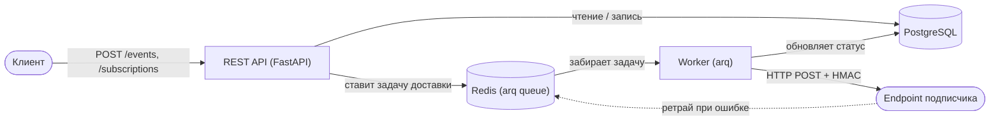

# Webhook Relay

[English version](README.md)

Асинхронный сервис доставки вебхуков: принимает события через HTTP API, находит подходящие подписки и надёжно доставляет payload подписчикам — с HMAC-подписью, ретраями с экспоненциальным backoff и dead-letter очередью для событий, которые не удалось доставить.

Похож на то, как работают Stripe Webhooks / Svix изнутри — только в компактном виде и как pet-проект для портфолио.

## Демо

Развёрнуто в [cloud.ru](https://cloud.ru) Container Apps:

- **Дашборд** — [webhook-relay.piksi.dev/dashboard/](https://webhook-relay.piksi.dev/dashboard/)
- **API-документация (Swagger)** — [webhook-relay.piksi.dev/docs](https://webhook-relay.piksi.dev/docs)

Можно создать подписку и отправить тестовое событие прямо из дашборда.

## Возможности

- **Приём событий** через REST API с идемпотентностью по `idempotency_key` — повторная отправка того же события не создаёт дублирующих доставок.
- **Подписки** на типы событий: один эндпоинт (`url`) подписывается на список `event_types`; при создании события система сама определяет, кому его доставить.
- **HMAC-подпись запросов** (`X-Signature`, `X-Timestamp`) — получатель может проверить подлинность payload, секрет подписки хранится в БД в зашифрованном виде (Fernet).
- **Ретраи с backoff и джиттером**: сетевые ошибки, таймауты и 5xx/429 автоматически переотправляются с экспоненциальной задержкой; уважается заголовок `Retry-After`.
- **Dead Letter Queue**: доставки, исчерпавшие лимит попыток или получившие финальную ошибку (4xx), попадают в DLQ и могут быть переотправлены вручную через API.
- **Полная история попыток** — каждая попытка доставки (HTTP-статус, длительность, ошибка) сохраняется отдельно для трассировки.
- **Асинхронная обработка** — доставка выполняется фоновым воркером через очередь задач (arq/Redis), API отвечает мгновенно (202 Accepted).
- **Mock-приёмник** — отдельный сервис для локальной проверки доставки, эмулирующий успех/таймаут/500/400.
- **Web-дашборд** — наблюдение за доставками, DLQ и подписками, см. [Web UI](#web-ui).

## Архитектура



Поток данных:

1. Клиент создаёт **подписку** (`POST /subscriptions`) с URL и списком типов событий.
2. Клиент публикует **событие** (`POST /events`). Сервис находит активные подписки на этот `event_type`, создаёт по одной записи `Delivery` на каждую и ставит задачи в очередь.
3. Фоновый **воркер** забирает задачу, подписывает тело запроса, отправляет POST на URL подписчика.
4. По результату (успех / retryable-ошибка / финальная ошибка) доставка помечается `DELIVERED`, переставится в очередь как `RETRYING` с задержкой, либо уйдёт в `FAILED` + запись в **dead_letters**.
5. Проваленные доставки можно посмотреть и переотправить вручную через `/dead-letters`.

## Стек

- **API** — FastAPI, Pydantic v2
- **База данных** — PostgreSQL, SQLAlchemy 2.0 (async), Alembic
- **Очередь задач** — Redis + arq
- **HTTP-клиент** — httpx (async)
- **Подпись/шифрование** — HMAC-SHA256, Fernet (cryptography)
- **Тесты** — pytest, pytest-asyncio, respx
- **Инфраструктура** — Docker, docker-compose
- **Web UI** — Jinja2 + HTMX (server-rendered, без сборки фронтенда)

Проект придерживается слоистой архитектуры: `routes → services → repositories → models`, бизнес-логика (классификация ответа, backoff) вынесена в чистые функции (`core/retry_policy.py`), не зависящие от фреймворка.

## Структура проекта

```
src/webhook_relay/
├── api/routes/        # HTTP-эндпоинты (events, subscriptions, dead-letters, dashboard)
├── core/              # бизнес-логика без привязки к фреймворку (retry policy и т.д.)
├── models/            # модели SQLAlchemy
├── repositories/       # слой доступа к данным
├── schemas/           # Pydantic-схемы запросов/ответов
├── security/          # HMAC-подпись, шифрование секретов
├── services/          # оркестрация use-case'ов
├── worker/            # точка входа arq-воркера + задача доставки
├── templates/         # Jinja2-шаблоны дашборда
└── static/            # CSS дашборда
mock_receiver/         # отдельное FastAPI-приложение для локального тестирования доставки
tests/
├── unit/              # бизнес-логика с моками зависимостей
└── integration/       # полный цикл через реальные Postgres/Redis + HTTP API
```

## Запуск

### Через Docker Compose (рекомендуется)

`docker-compose.yml` не поднимает Postgres/Redis для разработки (только для тестов, см. ниже) — нужен свой Postgres и Redis (локально или в облаке).

```bash
cp .env.example .env
# заполнить DATABASE_URL, REDIS_URL, SECRET_ENCRYPTION_KEY своими значениями
uv run alembic upgrade head
docker compose up --build
```

Поднимутся три сервиса:

- `api` — FastAPI на `localhost:8000` (Swagger: `/docs`)
- `worker` — arq-воркер, доставляющий вебхуки
- `mock-receiver` — тестовый приёмник вебхуков на `localhost:9000`

### Локально (uv)

```bash
uv sync
uv run alembic upgrade head
uv run uvicorn webhook_relay.main:app --reload            # API
uv run arq webhook_relay.worker.settings.WorkerSettings    # Worker (в отдельном терминале)
```

## Пример использования

```bash
# 1. Создать подписку
curl -X POST localhost:8000/subscriptions/ \
  -H "Content-Type: application/json" \
  -d '{"url": "http://localhost:9000/webhook", "event_types": ["order.created"]}'

# 2. Отправить событие
curl -X POST localhost:8000/events/ \
  -H "Content-Type: application/json" \
  -d '{"event_type": "order.created", "payload": {"order_id": 42}, "idempotency_key": "order-42"}'

# 3. Проверить, что получил mock-receiver
curl localhost:9000/_control/received

# 4. Посмотреть попытки доставки конкретной подписки
curl "localhost:8000/subscriptions/{id}/deliveries"

# 5. Переотправить проваленную доставку из DLQ
curl -X POST "localhost:8000/dead-letters/{id}/retry"
```

Можно эмулировать сбои получателя, переключая режим mock-receiver:

```bash
curl -X POST localhost:9000/_control/mode/fail     # 500 на каждый запрос
curl -X POST localhost:9000/_control/mode/timeout  # зависание
curl -X POST localhost:9000/_control/mode/reject   # 400 (финальная ошибка, без ретраев)
curl -X POST localhost:9000/_control/mode/ok        # обратно в норму
```

## Web UI

Дашборд на `localhost:8000/dashboard/` — доступен сразу вместе с API, отдельно поднимать не нужно:

- **Deliveries** — список доставок с фильтром по статусу и типу события, KPI-плашки по статусам за 24 часа.
- **Delivery detail** — событие (payload), подписка, полная история попыток (HTTP-статус, длительность, ошибка).
- **Dead Letters** — очередь непроставленных доставок с ретраем в один клик.
- **Subscriptions** — список, создание и удаление подписок.

Реализован без отдельного фронтенд-стека: HTML рендерится сервером (Jinja2), точечные обновления (фильтры, ретрай, удаление) — через HTMX-запросы без перезагрузки страницы.

## Тесты

```bash
docker compose --profile test up -d postgres-test redis-test
uv run pytest
```

Юнит-тесты покрывают бизнес-логику (retry policy, HMAC, сервисы с моками), интеграционные — полный цикл доставки через реальные Postgres/Redis и HTTP API.

## Деплой

Сервис собирается в один Docker-образ (см. [Dockerfile](Dockerfile)) и запускается как два независимых процесса из одного и того же образа:

| Процесс  | Команда                                                     | Публичный порт |
| -------- | ----------------------------------------------------------- | -------------- |
| `api`    | `uvicorn webhook_relay.main:app --host 0.0.0.0 --port 8000` | 8000           |
| `worker` | `arq webhook_relay.worker.settings.WorkerSettings`          | нет (фоновый)  |

Оба процесса используют одинаковые `DATABASE_URL`, `REDIS_URL` и `SECRET_ENCRYPTION_KEY` — они координируются только через Postgres и Redis, никогда не общаясь друг с другом напрямую. Перед первым деплоем нужно прогнать `alembic upgrade head` на целевой базе.

Проект развёрнут в [cloud.ru](https://cloud.ru) Container Apps как три сервиса из одного образа (`api`, `worker`, `mock-receiver`), с managed PostgreSQL и Redis.

## Возможные улучшения

- Rate limiting и circuit breaker на подписку.
- Поддержка нескольких event-схем и валидации payload.
- Метрики (Prometheus) и трейсинг доставок.
